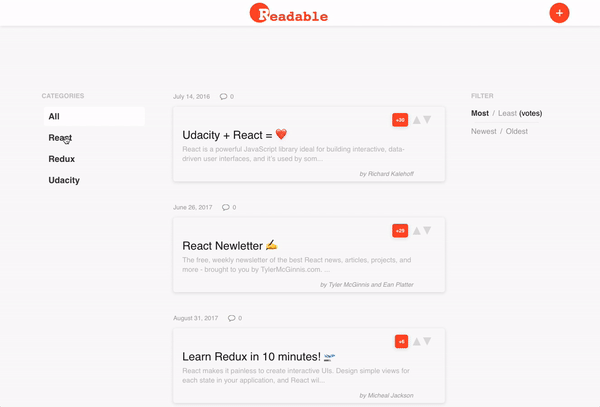

<h1 align="center">
  
  <br>
</h1>
<p align="center" style="font-size: 1.2rem;">A content and comment web app similar to Hacker News and Reddit made with React</p>

<hr />

<div align="center">
  
  <br>
</div>

Users can post content to predefined categories, comment on their posts and other users' posts, and vote on posts and comments. Users will also be able to edit and delete posts and comments.

> This was created as a part of the [Udacity React Nanodegree](https://www.udacity.com/course/react-nanodegree--nd019).

## Getting Started

```shell
$ git clone https://github.com/romarioraffington/react-readable.git
$ npm install
$ npm start
```
> Note: Running `npm start` will start the backend server then the frontend server. 


## Building the Project

```shell
$ npm run build
```

## Backend
The backend was provided by Udacity. Information about the API server and how to use it can be found [here](docs/API.md).

## LICENSE

MIT